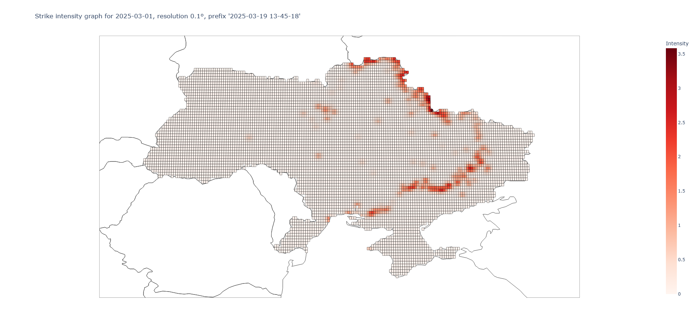
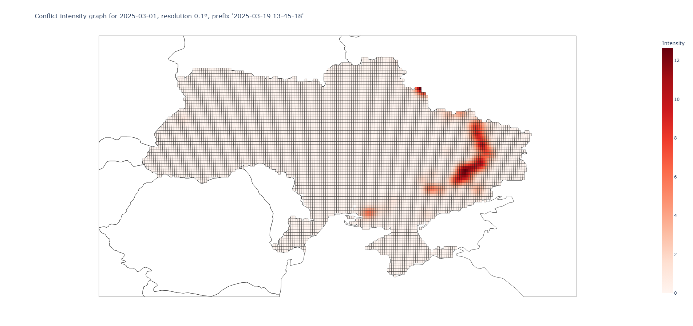
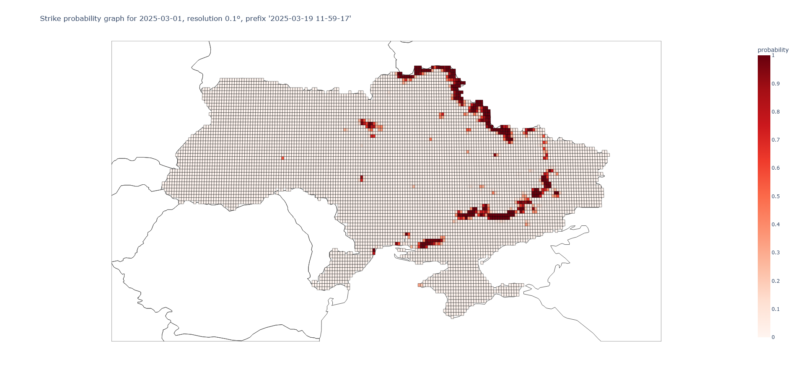
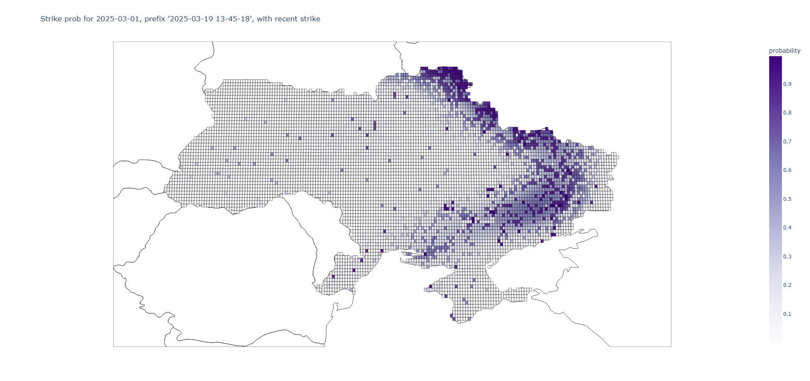
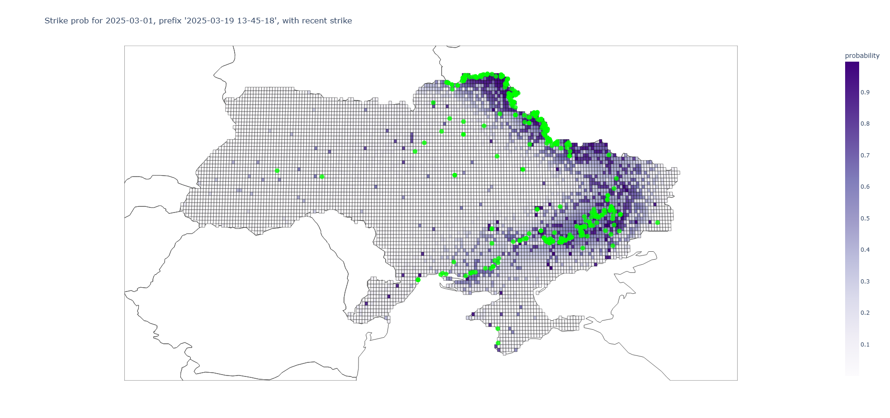

# Air Strike Risk Modeling

A repository dedicated to building and sharing a **risk model for air strikes**. Originally inspired by the Ukrainian context, this approach can theoretically be applied to other regions worldwide where the risk of air strikes or similar conflict events must be assessed.

## Purpose and Use Cases

- **(Micro-)Insurance**: Potentially useful for pricing or designing parametric coverage triggered by nearby strikes or conflict intensity.  
- **(Micro-)Credit Providers**: Helps quantify exposure in portfolios if clients are at risk of conflict-related losses.

## License

Released under the **GNU GPL v3** license, meaning it’s free software with strong copyleft. See [LICENSE](LICENSE) for the full text.  
Open to any and all contributions – please feel free to submit pull requests or open issues.

## Special Thanks

A special thanks to **ChatGPT** for significant help with brainstorming, code snippets, and refining documentation.

## Data Sources

1. **Conflict & Strike Data**  
   - [ACLED](https://acleddata.com/) – Historical air strike records, conflict events, geolocations, etc.

2. **Land Coverage**  
   - [ESA WorldCover](https://esa-worldcover.org/en) – Distinguishes urban areas vs. forests, cropland, wetlands, etc., to indicate higher or lower strike likelihood. See https://github.com/ESA-WorldCover/esa-worldcover-datasets for easy download.

## Repository Structure

This repository is organized into **three main folders**:

1. **`utils/`**  
   - Scripts and notebooks primarily for data exploration, cleaning, or quick lookups.  
   - Helpful for anyone wanting to understand or visualize raw conflict data.

2. **`glm_model/`**  
   - Implements a **Generalized Linear Model** (GLM) approach to predict strike probability.  
   - Includes a dedicated `README.md` with instructions on how to run and modify the GLM code.

3. **`gam_model/`**  
   - Implements a **Generalized Additive Model** (GAM) approach to capture non-linearities, especially for latitude/longitude effects.  
   - Also contains a `README.md` with model-specific usage details.

## Notes & Extras

- **Further Improvements**:  
  - Incorporating more refined data sources, e.g., advanced conflict intensity metrics or updated ESA WorldCover versions.  
  - Tuning hyperparameters or exploring other modeling frameworks (random forests, boosting) for better accuracy or interpretability.  
  - Testing in different conflict contexts beyond Ukraine.

- **Disclaimers**:  
  - This is **experimental**. The model is not guaranteed to be accurate or free from biases.  
  - Users should validate results with domain experts before relying on it for operational decisions.

## Getting Started

1. **Clone the Repo**:
   ```bash
   git clone https://github.com/QuietQuant/AirStrikeRiskModel.git

2. **Create `Input` and `Output` folders**:
   - Create two folders anywhere: `Input` and `Output`.
   - Map those folders to the corresponding paths in the scripts.
   - The `Input` folder should contain the raw data files, while the `Output` folder will store model results.

## Contributing
Contributions are welcome! Feel free to:
- Submit issues if you encounter bugs or have improvement ideas. 
- Open pull requests to add new features, fix typos, or refactor the code.

We hope this project helps researchers, insurers, and micro-credit providers better understand and manage conflict-related risks.

## Illustrations

Hare are some illustrations of the model's output. The results you will get could greatly differ depending on the data you use and the model's hyperparameters.

### Strike Intensity Heatmap



### Conflict Intensity Heatmap



### GLM probability map



### GAM probability map




